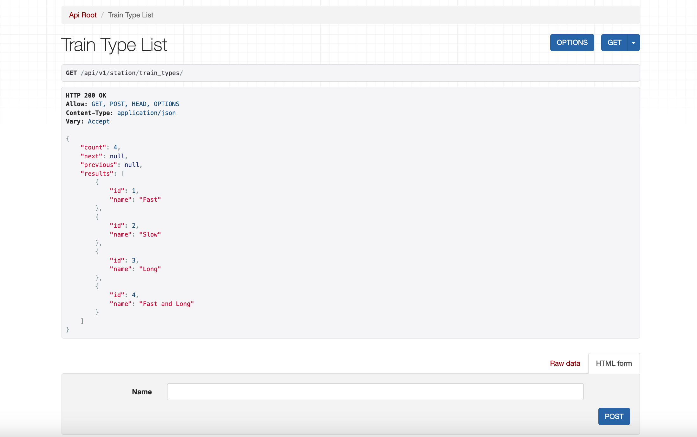
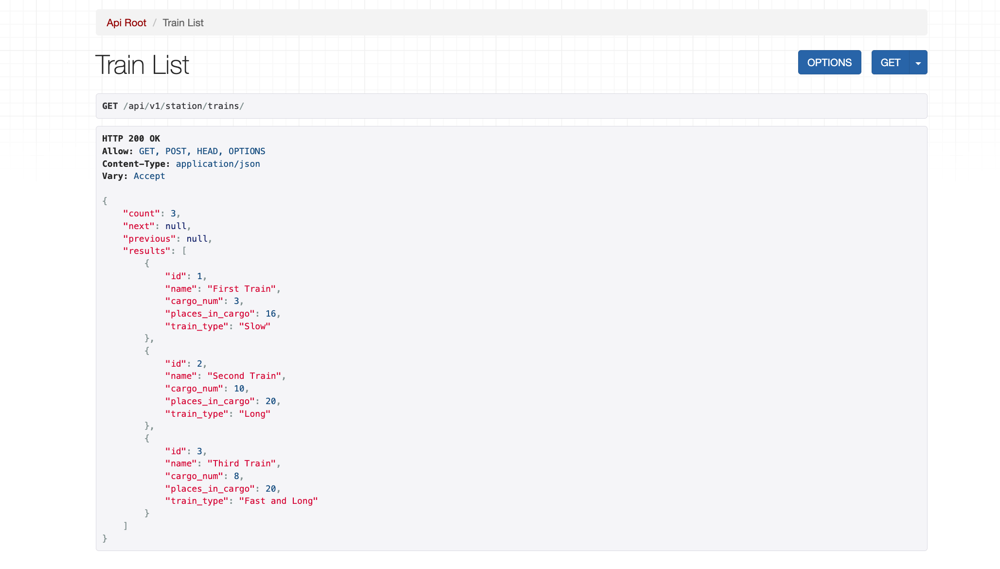
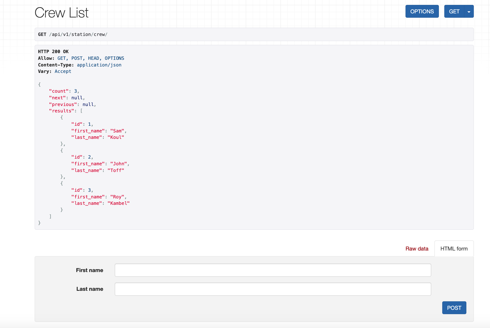
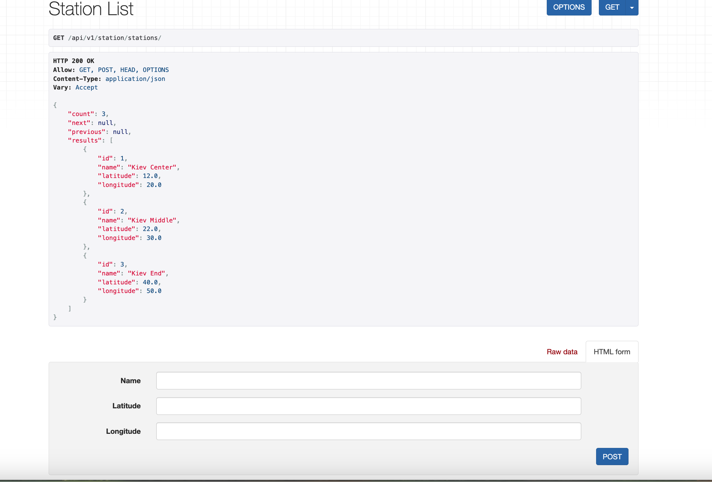
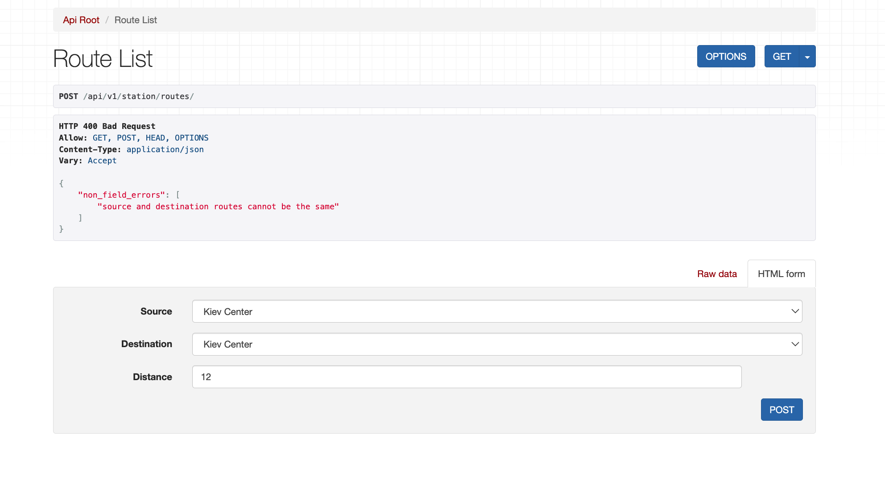
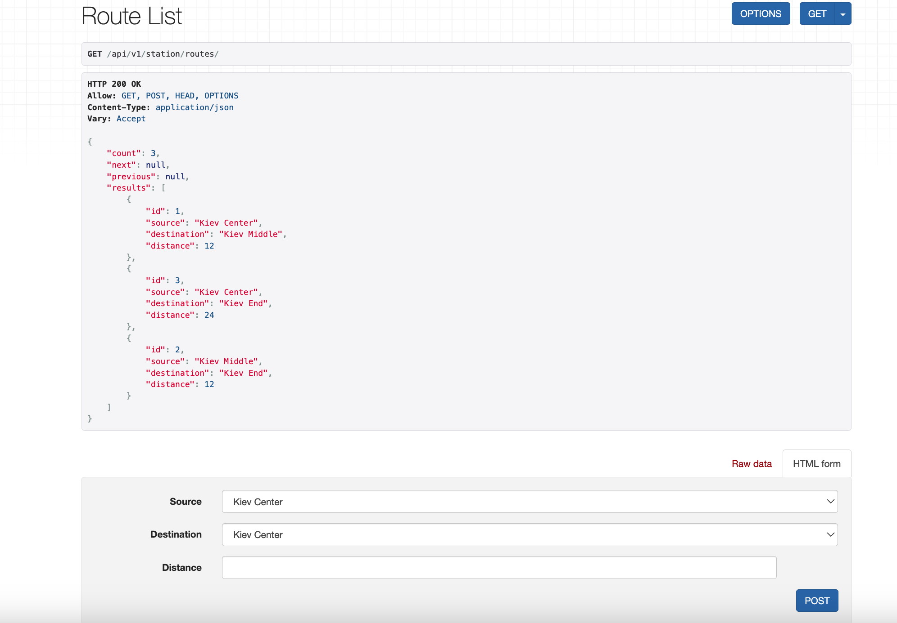
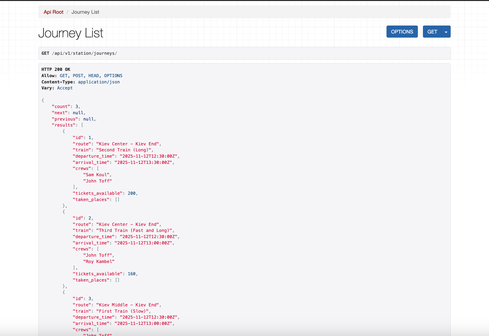
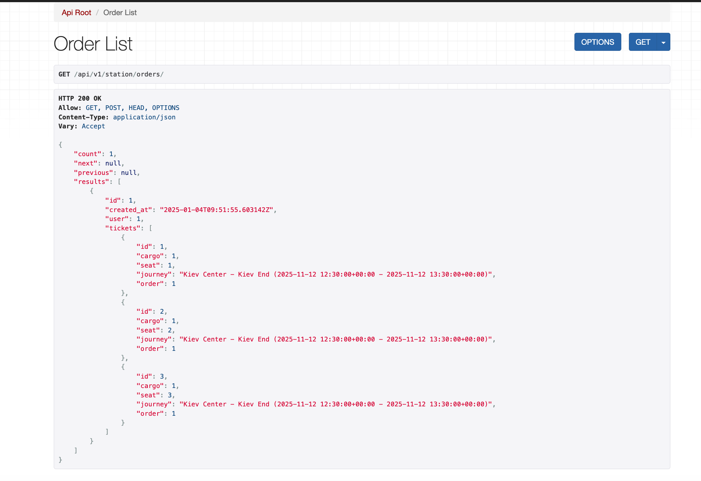

# Railway Station Management System

## Features

- **Train Management**: Manage train types, trains.
- **Crew Management**: Add, update, and assign crew members to journeys.
- **Station Management**: Manage railway stations with geolocation (latitude/longitude).
- **Route Management**: Create and validate routes between stations.
- **Journey Management**: Manage train journeys, their routes, and schedules.
- **Ticket Booking**: Reserve seats in train journeys and ensure seat availability.
- **Order Management**: Manage user orders for booked tickets.
- **Authentication**: Secure endpoints for authenticated users and administrators.
  - Users can only access their own orders and tickets.
  - Everyone can view taken places in a journey.
- **Filtering**: Query journeys based on route, departure, and arrival times.

This project use JWT Token

## Overview

### The application provides functionality for:

##### Managing trains, crews, stations, routes and journeys
##### Managing routes for journeys.
##### Creating and updating tickets and orders.

## Installation
```sh
docker-compose build
```

```sh
docker-compose up
```

## images








